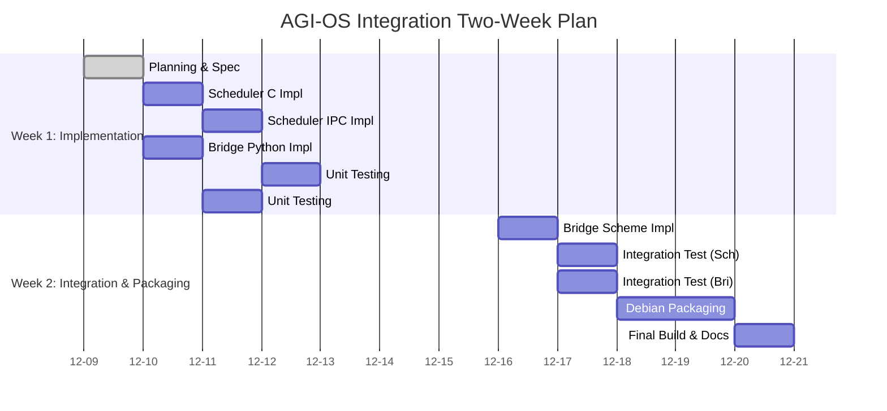

# AGI-OS Integration: Two-Week Project Plan

**Project**: Completion of `cognumach-cognitive-scheduler` and `hurdcog-occ-bridge`  
**Date**: December 9, 2025  
**Version**: 1.0  
**Author**: Manus AI

## 1. Project Overview

This document outlines a two-week project plan to complete, test, and document two high-priority integration packages for the AGI-OS: `cognumach-cognitive-scheduler` and `hurdcog-occ-bridge`. The successful completion of these components is critical for establishing seamless cognitive synergy between the Cognumach microkernel, the HurdCog operating system, and the OpenCog Collection (OCC) application layer.

## 2. Goals and Objectives

The primary goal is to deliver production-ready Debian packages for both components. This will be achieved through the following objectives:

*   **Complete Implementation**: Finalize the C, Python, and Scheme code for both packages, moving from stub implementations to fully functional modules.
*   **Robust Testing**: Develop and execute comprehensive unit and integration tests to ensure correctness, stability, and performance.
*   **Finalize Debian Packaging**: Complete all `debian/` control files, rules, and build scripts to ensure reliable and repeatable package builds.
*   **Comprehensive Documentation**: Create detailed implementation specifications, API documentation, and usage guides for developers.

## 3. Scope

### In Scope

*   Full implementation of the `cognitive_scheduler.c` and its integration with the Mach kernel via IPC.
*   Full implementation of the Python and Scheme components of the `hurdcog-occ-bridge`.
*   Creation of unit tests for all new code.
*   Creation of integration tests to validate the bridges between layers.
*   Completion of all files within the `opencog-debian/cognumach-cognitive-scheduler` and `opencog-debian/hurdcog-occ-bridge` directories.
*   Generation of final `.deb` packages for both components.

### Out of Scope

*   Implementation of other pending packages (e.g., `hurdcog-cogkernel-core` beyond what is necessary for the bridge).
*   Large-scale performance optimization and benchmarking.
*   Creation of a public-facing Debian repository.
*   Resolution of any newly discovered bugs in core OCC, HurdCog, or Cognumach components not directly related to the two packages.

## 4. Timeline and Milestones

This project is scheduled for a two-week (10 working days) duration.

### Week 1: Implementation and Unit Testing (Days 1-5)

| Day | Task                                                              | Deliverable                                    |
|:---:|-------------------------------------------------------------------|------------------------------------------------|
| 1   | **Planning & Spec**: Finalize implementation specs for both packages. | `COGNITIVE_SCHEDULER_SPEC.md`, `HURDCOG_BRIDGE_SPEC.md` |
| 2   | **Scheduler-C**: Implement core logic in `cognitive_scheduler.c`.   | Completed `cognitive_scheduler.c` file         |
| 3   | **Scheduler-IPC**: Implement Mach IPC hooks for the scheduler.      | IPC integration code                           |
| 4   | **Bridge-Python**: Implement the Python half of the `hurdcog-occ-bridge`. | Completed Python bridge script                 |
| 5   | **Unit Tests**: Write unit tests for all new C and Python code.     | `test_scheduler.c`, `test_bridge.py`           |

**Milestone for Week 1**: All stub code replaced with functional implementations and verified with unit tests.

### Week 2: Integration, Packaging, and Documentation (Days 6-10)

| Day | Task                                                              | Deliverable                                    |
|:---:|-------------------------------------------------------------------|------------------------------------------------|
| 6   | **Bridge-Scheme**: Implement the Scheme interface for the CogKernel. | Completed Scheme bridge script                 |
| 7   | **Integration Testing**: Test the full ECAN -> Scheduler -> Task loop. | `test_integration_scheduler.py`                |
| 8   | **Integration Testing**: Test the AtomSpace -> Bridge -> CogKernel loop. | `test_integration_bridge.py`                   |
| 9   | **Debian Packaging**: Finalize all `debian/` files for both packages. | Completed `debian/` directories                |
| 10  | **Build & Document**: Build final `.deb` packages and write API docs. | Final `.deb` packages, API documentation       |

**Milestone for Week 2**: Both packages are successfully built as production-ready `.deb` files and fully documented.

## 5. Deliverables

1.  **Source Code**:
    *   Completed `integration/cognitive-scheduler/` directory.
    *   Completed `integration/cogkernel-bridge/` (formerly part of `hurdcog-occ-bridge`).
2.  **Debian Packages**:
    *   `cognumach-cognitive-scheduler_1.0.0-1_i386.deb`
    *   `hurdcog-occ-bridge_1.0.0-1_any.deb`
3.  **Documentation**:
    *   `COGNITIVE_SCHEDULER_SPEC.md`: Implementation specification.
    *   `HURDCOG_BRIDGE_SPEC.md`: Implementation specification.
    *   API documentation for all new modules.
4.  **Project Management**:
    *   This project plan document.
    *   A Kanban board (`PROJECT_KANBAN.md`) for tracking progress.

## 6. Gantt Chart

## 7. Risk Management

| Risk                               | Probability | Impact | Mitigation Strategy                                                                                             |
|------------------------------------|:-----------:|:------:|-----------------------------------------------------------------------------------------------------------------|
| Mach IPC integration is complex.   | Medium      | High   | Allocate an extra half-day for this task. Refer to existing Cognumach IPC examples and documentation extensively. |
| Unforeseen bugs in dependencies.   | Low         | High   | Isolate the issue with minimal reproducible examples. If it cannot be resolved quickly, create a stub and log the bug. |
| Integration testing reveals flaws. | Medium      | Medium | Use detailed logging and debugging tools. Revert to unit tests to isolate the faulty component.                   |
| Build environment issues.          | Low         | Medium | The `occ` repository uses a containerized dev environment, minimizing this risk. Rebuild the container if necessary. |

## 8. Resource Allocation

This project will require the following resources:

**Human Resources**:

*   **1 Senior Systems Engineer**: Responsible for the C implementation of the cognitive scheduler and the Mach IPC integration. This engineer must have deep knowledge of kernel programming and the Mach microkernel architecture.
*   **1 Software Engineer**: Responsible for the Python and Scheme components of the `hurdcog-occ-bridge`. This engineer should be proficient in Python, Scheme, and the OpenCog AtomSpace API.
*   **1 QA Engineer**: Responsible for writing and executing all unit and integration tests. This engineer should be familiar with testing methodologies for both kernel modules and distributed systems.

**Infrastructure**:

*   **Development Environment**: A dedicated machine or virtual machine running the full AGI-OS stack (Cognumach, HurdCog, and OCC). This environment must be set up before Day 1.
*   **Build Server**: A server for building the Debian packages. This can be the same as the development environment or a separate CI/CD server.
*   **Version Control**: The existing GitHub repository (`cogpy/occ`) will be used for all code and documentation.

**Time Allocation**:

Each engineer is expected to dedicate approximately 8 hours per day to this project, for a total of 80 hours per engineer over the two-week period. The QA engineer's time will be more concentrated in Week 2.

## 9. Success Criteria

The project will be considered successful if the following criteria are met:

1.  **Functional Completeness**: Both packages implement all features described in their respective specifications.
2.  **Test Coverage**: All unit tests pass, and integration tests demonstrate the correct end-to-end flow of data between layers.
3.  **Package Build**: Both `.deb` packages build without errors and can be installed on a clean AGI-OS system.
4.  **Documentation**: All API functions are documented, and usage guides are clear and comprehensive.
5.  **Code Quality**: The code adheres to the coding standards of the respective languages (C, Python, Scheme) and passes linting checks.

## 10. Dependencies and Prerequisites

Before starting this project, the following must be in place:

*   **Cognumach**: A working build of the Cognumach microkernel with the standard Mach scheduler operational.
*   **HurdCog**: A working build of the HurdCog operating system with the MachSpace and CogKernel services running.
*   **OCC**: A working installation of the OpenCog Collection with the AtomSpace and ECAN components functional.
*   **Build Tools**: The MIG (Mach Interface Generator) must be available and functional, as it is required for generating IPC stubs.
*   **Development Libraries**: All development headers for Cognumach, HurdCog, and OCC must be installed.

## 11. Communication Plan

The team will hold daily stand-up meetings (15 minutes) at the start of each working day to discuss progress, blockers, and plans for the day. A Slack channel or equivalent will be set up for asynchronous communication. The project manager will send a weekly status report to stakeholders summarizing progress against the Gantt chart.

## 12. Change Management

If any significant changes to the scope, timeline, or resources are required, they must be approved by the project manager and documented in this plan. Minor adjustments (e.g., a task taking half a day longer than estimated) can be handled within the team without formal approval, but they should be noted in the Kanban board.

## 13. Conclusion

This two-week project plan provides a clear roadmap for completing the `cognumach-cognitive-scheduler` and `hurdcog-occ-bridge` packages. By following this plan, the team will deliver production-ready integration components that are critical for the AGI-OS architecture. The successful completion of these packages will enable seamless cognitive synergy between the Cognumach microkernel, the HurdCog operating system, and the OpenCog Collection, bringing the vision of a fully integrated AGI Operating System one step closer to reality.

---

**Document Version**: 1.0  
**Last Updated**: December 9, 2025  
**Next Review**: December 16, 2025 (End of Week 1)
