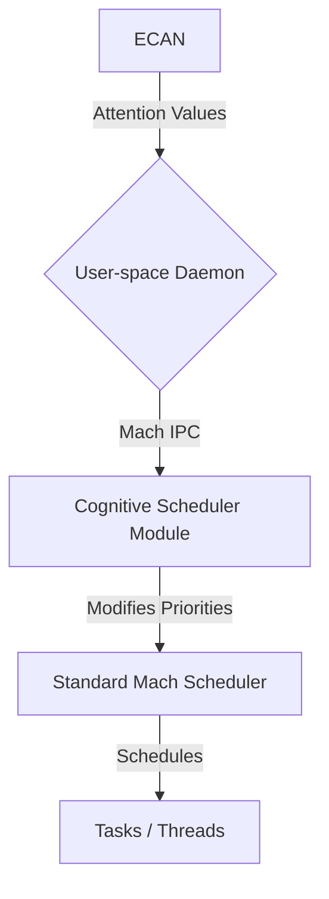

# Cognitive Scheduler Implementation Specification

**Component**: `cognumach-cognitive-scheduler`  
**Date**: December 9, 2025  
**Version**: 1.0  
**Author**: Manus AI

## 1. Overview

This document provides the detailed implementation specification for the `cognumach-cognitive-scheduler`. This component extends the standard Mach scheduler in the Cognumach microkernel to be aware of cognitive states, primarily by incorporating attention values from the Economic Attention Network (ECAN) in the OpenCog Collection (OCC) layer.

## 2. Architecture

The cognitive scheduler will be implemented as a loadable kernel module for Cognumach. It will intercept the standard scheduling decisions and modify task priorities based on attention values received from the user space via a dedicated Mach IPC port.



## 3. Data Structures

### `cognitive_task_info`

A new structure will be added to the task struct to hold cognitive information.

```c
struct cognitive_task_info {
    attention_value_t attention;
    workload_type_t workload;
    uint64_t last_update;
};
```

### `attention_value_t`

This structure, defined in `cognitive_scheduler.h`, will remain as is:

```c
typedef struct {
    float sti;          /* Short-term importance */
    float lti;          /* Long-term importance */
    float vlti;         /* Very long-term importance */
    uint64_t timestamp; /* Last update timestamp */
} attention_value_t;
```

## 4. IPC Mechanism

A dedicated Mach IPC port named `opencog.cognitive_scheduler` will be registered by the kernel module upon loading. A user-space daemon will be responsible for connecting to this port and forwarding attention values from ECAN.

### IPC Message Format

The message will be a simple fixed-size structure.

```c
struct cognitive_ipc_message {
    mach_msg_header_t header;
    uint64_t task_id; // The Mach task ID
    attention_value_t attention;
};
```

## 5. Scheduling Algorithm

The core of the scheduler will be a function that calculates a new priority for a task based on its current priority and its attention value.

**Formula**:

`new_priority = base_priority + (sti_weight * sti) + (lti_weight * lti)`

*   `base_priority`: The task's original priority.
*   `sti_weight`, `lti_weight`: Configurable weights for short-term and long-term importance. These will be tunable via `sysctl`.

### Learning Component

The `cognitive_sched_learn` function will be implemented to adjust the `sti_weight` and `lti_weight` based on observed system performance. Initially, this will be a simple reinforcement learning model that increases weights if system throughput improves after a scheduling decision and decreases them otherwise.

## 6. API Implementation

The functions defined in `cognitive_scheduler.h` will be implemented as follows:

*   `cognitive_sched_init()`: Initializes the IPC port and the `sysctl` entries for the weights.
*   `cognitive_sched_set_attention()`: This will be the handler for the IPC messages. It will find the task by its ID and update its `cognitive_task_info`.
*   `cognitive_sched_get_attention()`: Returns the current attention value for a task.
*   `cognitive_sched_set_policy()`: Allows switching between `SCHED_POLICY_TRADITIONAL` and `SCHED_POLICY_ATTENTION`.
*   `cognitive_sched_learn()`: Implements the reinforcement learning algorithm.

## 7. Testing Strategy

### Unit Tests (`test_scheduler.c`)

*   Test the priority calculation formula with various attention values and weights.
*   Test the learning algorithm with simulated performance feedback.
*   Test the IPC message packing and unpacking.

### Integration Tests (`test_integration_scheduler.py`)

A Python script will act as the user-space daemon. It will:

1.  Create a set of child processes with different base priorities.
2.  Send attention values for these processes via the Mach IPC port.
3.  Monitor the actual CPU time received by each process using `ps` or a similar tool.
4.  Assert that processes with higher attention values receive more CPU time, relative to their base priority.

## 8. Debian Package (`cognumach-cognitive-scheduler`)

*   **Source**: The completed `integration/cognitive-scheduler/` directory.
*   **Build**: The `debian/rules` file will use `make` to build the `.o` file and then `ld` to create the final kernel module, `cognitive_scheduler.ko`.
*   **Installation**: The `debian/install` file will place `cognitive_scheduler.ko` in `/lib/modules/$(uname -r)/kernel/mach/`.
*   **Post-install script**: Will run `depmod -a` to update module dependencies.
