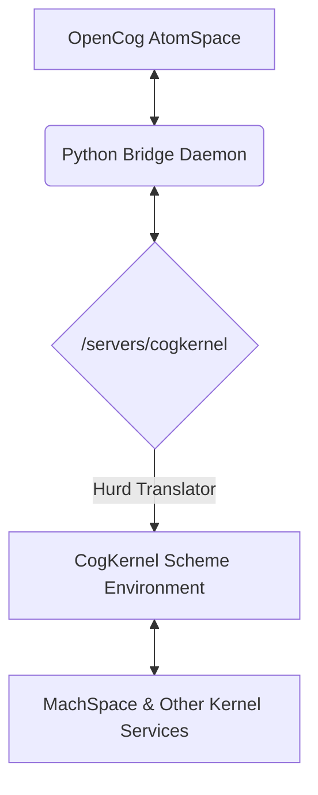

# HurdCog-OCC Bridge Implementation Specification

**Component**: `hurdcog-occ-bridge`  
**Date**: December 9, 2025  
**Version**: 1.0  
**Author**: Manus AI

## 1. Overview

This document provides the detailed implementation specification for the `hurdcog-occ-bridge`. This component provides the critical bidirectional communication channel between the OpenCog Collection (OCC) running in user space and the cognitive services running within the HurdCog operating system, such as the CogKernel and MachSpace.

## 2. Architecture

The bridge consists of two main parts: a Python-based user-space daemon and a set of Scheme-based procedures for the HurdCog environment. Communication between the two is achieved via a custom Hurd translator that exposes a file-like interface to the CogKernel's services.



*   The **Python Bridge Daemon** runs in user space, connects to the local AtomSpace, and monitors for specific atoms designated for the kernel.
*   The **Hurd Translator** (`/servers/cogkernel`) presents the CogKernel as a file system node. Writing to this node sends a command to the kernel, and reading from it retrieves a result.
*   The **CogKernel Scheme Environment** receives commands from the translator, executes them (e.g., by performing a URE query), and writes the result back.

## 3. Components

### Python Bridge Daemon (`bridge.py`)

This script will be the main entry point for the user-space component.

*   **AtomSpace Connection**: It will use the `opencog.atomspace` Python bindings to connect to the main AtomSpace.
*   **Command Handling**: It will query the AtomSpace for atoms of type `KernelCommandNode`. When found, it will serialize the command and write it to `/servers/cogkernel`.
*   **Result Handling**: It will read the response from `/servers/cogkernel`, deserialize it, and insert the resulting atoms (e.g., `KernelResultNode`) back into the AtomSpace.
*   **Serialization**: Atoms will be serialized to a simplified JSON format for transport.

    ```json
    {
        "type": "ConceptNode",
        "name": "my-concept",
        "tv": { "mean": 1.0, "count": 1.0 }
    }
    ```

### Scheme Bridge (`cogkernel-bridge.scm`)

This script will run within the Guile environment of the HurdCog CogKernel.

*   **Command Deserialization**: It will read the JSON string from the translator's input buffer and parse it into a Scheme representation of the atom.
*   **Execution**: It will use a `case`-based dispatcher to execute the command. For example, a `GroundedSchemaNode` might trigger a URE query.
*   **Result Serialization**: It will take the result of the execution (e.g., a set of atoms from a query), serialize it to JSON, and write it to the translator's output buffer.

## 4. API and Command Set

The primary API will be the set of `KernelCommandNode` types that the bridge recognizes.

*   `KernelQueryNode`: Executes a query in the CogKernel's local AtomSpace (which is backed by MachSpace).
*   `KernelExecuteNode`: Executes a `GroundedSchemaNode` within the kernel environment.
*   `KernelAttentionNode`: Pushes an attention value down to the `cognitive-scheduler` via the CogKernel.

## 5. Testing Strategy

### Unit Tests

*   `test_bridge.py`: Will test the Python component's serialization/deserialization logic and its interaction with a mock `/servers/cogkernel` file.
*   `test_cogkernel_bridge.scm`: Will test the Scheme component's JSON parsing and command dispatching logic with sample JSON inputs.

### Integration Tests (`test_integration_bridge.py`)

A Python script will perform an end-to-end test:

1.  Start a local AtomSpace.
2.  Insert a `KernelQueryNode` into the AtomSpace.
3.  Run the `bridge.py` daemon.
4.  The test will assume a running HurdCog environment with the translator and CogKernel active.
5.  Poll the AtomSpace for a corresponding `KernelResultNode`.
6.  Assert that the result is correct.

## 6. Debian Package (`hurdcog-occ-bridge`)

*   **Source**: The Python scripts and Scheme files that constitute the bridge.
*   **Dependencies**: `python3`, `opencog-atomspace` (for the Python bindings), `hurdcog-cogkernel-core`, `guile-3.0`.
*   **Installation**:
    *   The `bridge.py` daemon will be installed in `/usr/bin/`.
    *   The `cogkernel-bridge.scm` script will be installed in `/usr/share/hurdcog/scripts/`.
*   **Systemd Service**: A `hurdcog-occ-bridge.service` file will be included to run the `bridge.py` daemon automatically on system startup.
